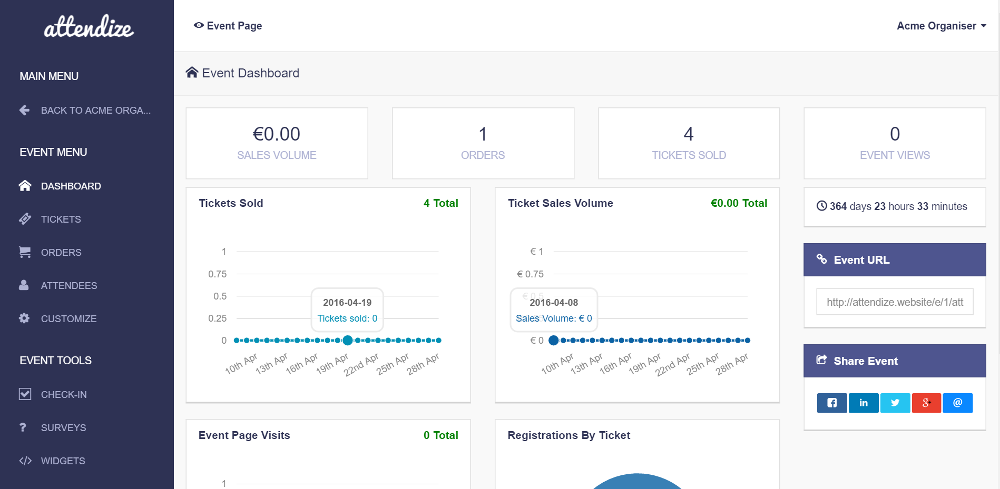

# Attendize CI/CD pipeline

Deploy Attendize server with CI/CD on Elestio

 
 

# Once deployed ...

You can open Attendize UI here:

    URL: https://[CI_CD_DOMAIN]
    email: [ADMIN_EMAIL]
    password: [ADMIN_PASSWORD]

You can open PHPMyAdmin web UI here:

    URL: https://[CI_CD_DOMAIN]:23121
    email: root
    password: [ADMIN_PASSWORD]
